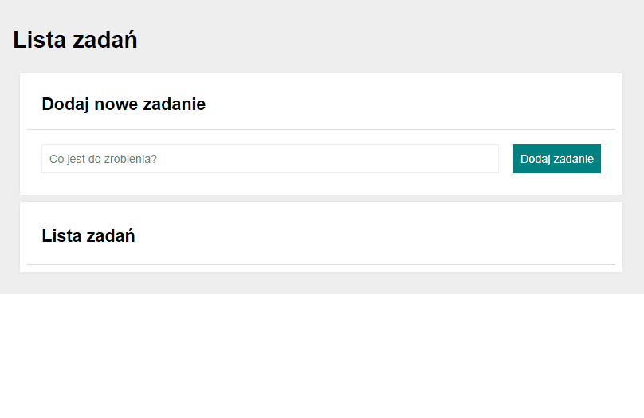

# list-to-do

## Demo

https://arcziwald.github.io/list-to-do/

## Description
My next website created while learning the profession of Frontender in the prestigious YouCode company.
This project is a tool for creating a task list and organizing it by hiding or deleting it, according to the completed items on the list.

## Tools&Technologes

- HTML
- CSS
- Java Script
- Normalize CSS
- BEM convention
- Grid box
